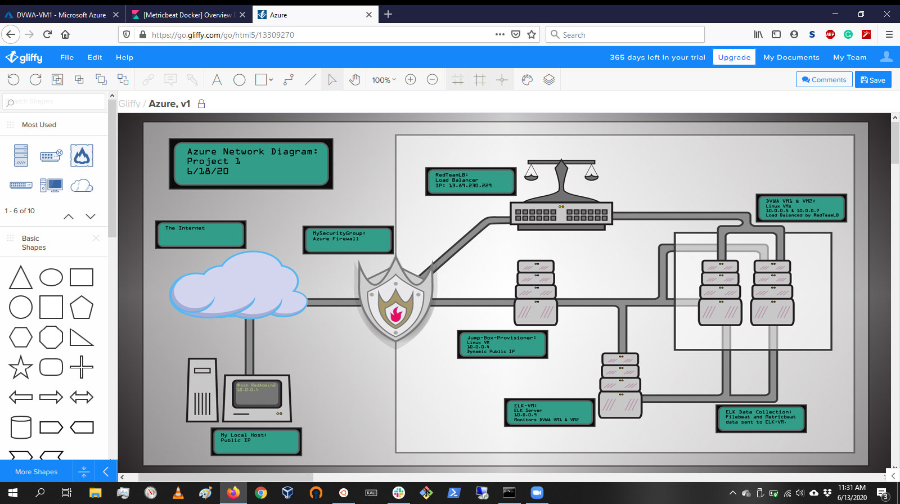

## Automated ELK Stack Deployment

The files in this repository were used to configure the network depicted below.

These files have been tested and used to generate a live ELK deployment on Azure. They can be used to either recreate the entire deployment pictured above. Alternatively, select portions of the <ins>ansible playbook</ins> file may be used to install only certain pieces of it, such as Filebeat.

  - ./Ansible/docker-playbook.yml ./Ansible/install-elk.yml ./Ansible/filebeat-playbook.yml ./Ansible/metricbeat-playbook.yml

This document contains the following details:
- Description of the Topology
- Access Policies
- ELK Configuration
  - Beats in Use
  - Machines Being Monitored
- How to Use the Ansible Build

### Description of the Topology

The main purpose of this network is to expose a load-balanced and monitored instance of DVWA, the D*mn Vulnerable Web Application.

Load balancing ensures that the application will be highly <ins>available</ins>, in addition to restricting <ins>exposure</ins> to the network.
- _What aspect of security do load balancers protect? What is the advantage of a jump box?_
- Load balancers protect availability of data. A jump box provides a single point of access and administration for the network.
Integrating an ELK server allows users to easily monitor the vulnerable VMs for changes to the <ins>files</ins> and system <ins>metrics</ins>.
- _What does Filebeat watch for?_
- It watches for changes to system files.
- _What does Metricbeat record?_
- It watches for changes to system metrics.

The configuration details of each machine may be found below.
_Note: Use the [Markdown Table Generator](http://www.tablesgenerator.com/markdown_tables) to add/remove values from the table_.

| Name       | Function           | IP Address | Operating System |
|------------|--------------------|------------|------------------|
| Jump Box   | Gateway            | 10.0.0.4   | Linux            |
| DVWA VM1   | Application Server | 10.0.0.5   | Linux            |
| DVWA VM2   | Application Server | 10.0.0.7   | Linux            |
| ELK Server | ELK                | 10.0.0.9   | Linux            |

### Access Policies

The machines on the internal network are not exposed to the public Internet. 

Only the <ins>Jump Box</ins> machine can accept connections from the Internet. Access to this machine is only allowed from the following IP addresses:
- 24.107.151.232

Machines within the network can only be accessed by <ins>an ssh connection through 10.0.0.4 using port 22</ins>.
- _Which machine did you allow to access your ELK VM? What was its IP address?_
- My local machine at 24.107.151.232.

A summary of the access policies in place can be found in the table below.

| Name     | Publicly Accessible                 | Allowed IP Addresses               |
|----------|-------------------------------------|------------------------------------|
| Jump Box | Yes port 22                         | 24.107.151.232                     |
| DVWA VM1 | Yes port 80; No port 22             | Public; 10.0.0.4                   |
| DVWA VM2 | Yes port 80; No port 22             | Public; 10.0.0.4                   |
| ELK      | Yes  port 5601; No ports 9200, 5044 | 24.107.151.232; 10.0.0.5, 10.0.0.7 |
### Elk Configuration

Ansible was used to automate configuration of the ELK machine. No configuration was performed manually, which is advantageous because...
- A large number of machines can be configured in exactly the same manner in one sequence.

The playbook implements the following tasks:
- Target machine installs docker.io using apt.
- Target machine installs python-pip using apt.
- Target machine install the docker python module using pip.
- Target machine sets its virtual memory to a larger capacity to handle running ELK.
- Target machine install an image an image containing ELK from a repository into a docker container and tells it to listen to ports 5601, 9200, and 5044.

The following screenshot displays the result of running `docker ps` after successfully configuring the ELK instance.

### Target Machines & Beats
This ELK server is configured to monitor the following machines:
- 10.0.0.5 & 10.0.0.7

We have installed the following Beats on these machines:
- Filebeat & Metricbeat.

These Beats allow us to collect the following information from each machine:
- Filebeat collects status and continuity of system files, an example being whenever sudo commands are run. Metricbeat collects system metrics and status, an example being memory usage of the machine.

### Using the Playbook
In order to use the playbook, you will need to have an Ansible control node already configured. Assuming you have such a control node provisioned: 

SSH into the control node and follow the steps below:
- Copy the <ins>.yml</ins> file to <ins>/etc/ansible/roles</ins>.
- Update the <ins>hosts</ins> file to include... <ins>target machines.</ins>
- Run the playbook, and navigate to <ins>http://23.99.210.83:5601</ins> to check that the installation worked as expected.

Answer the following questions to fill in the blanks:_
- _Which file is the playbook? Where do you copy it?_
- The .yml file. /etc/ansible/roles
- _Which file do you update to make Ansible run the playbook on a specific machine? How do I specify which machine to install the ELK server on versus which to install Filebeat on?_
- Hosts. Set groups of machines under group names using [] and "hosts" in playbook.
- _Which URL do you navigate to in order to check that the ELK server is running?
- http://23.99.210.83:5601

Provided are the specific commands the user will need to run to download the playbook, update the files, etc._

- git clone https://github.com/Brownpw07/CySecPro1.git
- sudo apt-get install ansible
- sudo nano /etc/ansible/hosts
-       > add target server lists for [webservers] & [elkservers].
- sudo ansible-playbook ./Ansible/docker-playbook.yml
- sudo ansible-playbook ./Ansible/install-elk.yml
- sudo ansible-playbook ./Ansible/filebeat-playbook.yml
- sudo ansible-playbook ./Ansible/metricbeat-playbook.yml

